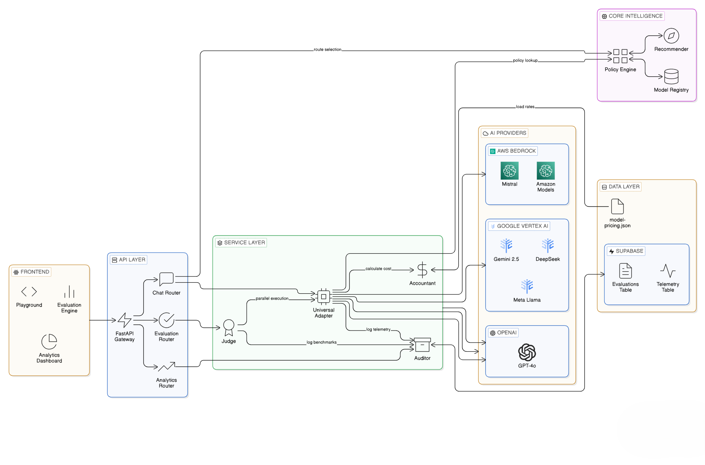

# 🌐 AI Cloud Governance Platform

A unified multi-cloud AI governance platform that routes requests across **6 AI providers**, tracks costs, latency, and token usage, and provides a real-time analytics dashboard.

> Built as part of the **Joint Cloud Initiative** — demonstrating how organizations can govern, monitor, and optimize AI workloads across multiple cloud providers.



---

## 🚀 Features

- **Unified `/chat` API** — Single endpoint that routes to the best model per provider and use case.
- **6 AI Providers Integrated**:
  | Provider | Gateway | Models |
  |---|---|---|
  | Google Gemini | Vertex AI + API Key | gemini-2.5-pro, flash, flash-lite |
  | OpenAI | Direct API | gpt-4o, gpt-4o-mini |
  | Meta Llama | Vertex AI (MaaS) | llama-3.3-70b |
  | Mistral AI | AWS Bedrock | mistral-small, mistral-large, pixtral-large |
  | Amazon Nova | AWS Bedrock | nova-pro, nova-lite |
  | DeepSeek | Vertex AI (MaaS) | deepseek-v3.2, deepseek-r1 |

- **Model Matrix Policy Engine** — Automatically selects the *Optimal Model* based on provider + intent (reasoning, vision, coding, etc.).
- **AI Judge Evaluation** — Built-in benchmarking engine that uses a "Judge Model" to score other models on Correctness, Safety, and Clarity (1-5 scale).
- **Persistent Benchmarking** — Stores evaluation batches in Supabase for historical replay and trend analysis.
- **FinOps Cost Tracking** — Real-time cost calculation per request using `model-pricing.json` (accurate to 6 decimal places).
- **Prompt Auditing** — Analyzes user prompts for clarity and intent before execution.
- **Telemetry Logging** — All interactions logged to Supabase (provider, model, tokens, cost, latency).

---

## 🏗️ Architecture

The platform uses a **FastAPI** backend to orchestrate a multi-provider gateway, while a **React** frontend provides a governance dashboard for Model Ops.

### **Core Components**
1.  **Intelligence Layer (`app/core`)**: 
    -   **`model_matrix.py`**: The "Brain" that holds the Golden Mapping of `Provider -> UseCase -> ModelID`.
2.  **Service Layer (`app/services`)**:
    -   **`ai_service.py`**: A unified adapter for Google Vertex, OpenAI, and AWS Bedrock.
    -   **`evaluation_service.py`**: Runs parallel benchmarks and the AI Judge logic.
    -   **`pricing_service.py`**: Calculates exact costs based on input/output token rates.
3.  **Persistence Layer**:
    -   **Supabase (PostgreSQL)**: Stores `telemetry` (operational logs) and `evaluations` (benchmark history).

---

## 📋 Prerequisites

- **Python 3.10+** — [Download](https://www.python.org/downloads/)
- **Node.js 18+** — [Download](https://nodejs.org/)
- **Google Cloud SDK (`gcloud`)** — [Install Guide](https://cloud.google.com/sdk/docs/install)
- **Git** — [Download](https://git-scm.com/)

---

## ⚡ Setup Guide (Step by Step)

> **Note:** If you already have the `.env` file and project access shared with you, skip straight to Step 1.

### Step 1 — Install Google Cloud SDK

Download and install from: https://cloud.google.com/sdk/docs/install

After installation, **restart your terminal**, then verify:

```bash
gcloud --version
```

### Step 2 — Authenticate with Google Cloud

```bash
# Login to your Google account
gcloud auth login

# Set up Application Default Credentials (ADC) — this is REQUIRED for Vertex AI
gcloud auth application-default login

# Set the project (ask the project owner for the Project ID)
gcloud config set project YOUR_PROJECT_ID
```

> ⚠️ **`gcloud auth application-default login` is critical.** Without it, Meta Llama and DeepSeek calls will fail because they use OAuth2 tokens via Vertex AI.

### Step 3 — Clone & Install

```bash
# Clone the repository
git clone https://github.com/your-username/AI_CLOUD_GOVERNANCE.git
cd AI_CLOUD_GOVERNANCE

# Backend setup
cd backend
python -m venv .venv
.venv\Scripts\activate        # Windows
# source .venv/bin/activate   # Mac/Linux
pip install -r requirements.txt

# Place the .env file (get it from the project owner)
# Copy the shared .env file into the backend/ folder

# Frontend setup
cd ../frontend
npm install
```

### Step 4 — Run

**Terminal 1 — Backend:**

```bash
cd backend
.venv\Scripts\activate
python -m uvicorn app.main:app --host 0.0.0.0 --port 8000 --reload
```

**Terminal 2 — Frontend:**

```bash
cd frontend
npm run dev
```

Open **http://localhost:5173** in your browser 🚀

### ❓ Troubleshooting

| Issue                                            | Fix                                                                                                                |
| ------------------------------------------------ | ------------------------------------------------------------------------------------------------------------------ |
| `google.auth.exceptions.DefaultCredentialsError` | Run `gcloud auth application-default login` again                                                                  |
| `Meta Llama / DeepSeek 404 error`                | Ensure the models are enabled in [Vertex AI Model Garden](https://console.cloud.google.com/vertex-ai/model-garden) |
| `OPENAI_API_KEY not set`                         | Make sure the `.env` file is in the `backend/` folder                                                              |
| `Module not found`                               | Make sure you activated the virtual environment                                                                    |

---

## 🔑 Environment Variables

Copy `backend/.env.example` to `backend/.env` and fill in your credentials:

| Variable                | Description                     |
| ----------------------- | ------------------------------- |
| `SUPABASE_URL`          | Supabase project URL            |
| `SUPABASE_KEY`          | Supabase anon/service key       |
| `GOOGLE_API_KEY`        | Google AI API key               |
| `GOOGLE_CLOUD_PROJECT`  | GCP Project ID                  |
| `GOOGLE_CLOUD_LOCATION` | GCP region (e.g. `us-central1`) |
| `OPENAI_API_KEY`        | OpenAI API key                  |
| `AWS_ACCESS_KEY_ID`     | AWS IAM access key              |
| `AWS_SECRET_ACCESS_KEY` | AWS IAM secret key              |
| `AWS_REGION`            | AWS region (e.g. `us-east-1`)   |

> ⚠️ **Never commit `.env` files.** The `.gitignore` is configured to exclude them.

---

## 📊 API Endpoints

| Method | Endpoint                 | Description |
| ------ | ------------------------ | --------------------------------- |
| `POST` | `/api/chat`              | Send a prompt to any AI provider |
| `POST` | `/api/chat/vision`       | Handle multi-modal image inputs |
| `POST` | `/api/eval/run`          | Run a batch evaluation with AI Judge |
| `GET`  | `/api/evaluation/history`| Fetch past benchmark results |
| `GET`  | `/api/analytics`         | Get aggregated analytics summary |
| `GET`  | `/api/models/registry`   | Get current Model Matrix config |
| `GET`  | `/docs`                  | Swagger UI (interactive API docs) |

### Chat Request Body

```json
{
  "provider": "Google",
  "use_case": "reasoning",
  "prompt": "Explain cloud governance in one sentence"
}
```

### Chat Response

```json
{
  "response": "Cloud governance is...",
  "provider": "Google",
  "model_id": "gemini-2.5-pro",
  "use_case": "reasoning",
  "metrics": {
    "input_tokens": 12,
    "output_tokens": 45,
    "cost": 0.000506,
    "latency_ms": 1423
  }
}
```

---

## 🗂️ Project Structure

```
AI_CLOUD_GOVERNANCE/
├── backend/
│   ├── app/
│   │   ├── api/endpoints/     # chat.py, analytics.py, evaluation.py
│   │   ├── core/              # config.py, model_matrix.py (Policy Engine)
│   │   ├── models/            # schemas.py (Pydantic)
│   │   ├── services/          # ai_service, pricing_service, evaluation_service, supabase_service
│   │   └── main.py            # FastAPI app
│   ├── tests/                 # Provider test scripts
│   ├── model-pricing.json     # Cost per million tokens
│   ├── requirements.txt
│   └── .env.example
├── frontend/
│   ├── src/
│   │   ├── App.jsx            # Chat interface
│   │   ├── AnalyticsDashboard.jsx  # Analytics with Recharts
│   │   ├── EvaluationEngine.jsx    # Benchmarking & AI Judge
│   │   └── data.js            # Model matrix & pricing data
│   └── package.json
├── .gitignore
└── README.md
```

---

## 🛡️ Security

- All API keys stored in `.env` (gitignored)
- OAuth2 token refresh for Vertex AI (Meta, DeepSeek)
- AWS IAM credentials for Bedrock
- CORS configured for frontend access
- No hardcoded credentials in source code

---

## 📄 License

This project is for educational and research purposes as part of the Joint Cloud Initiative.


